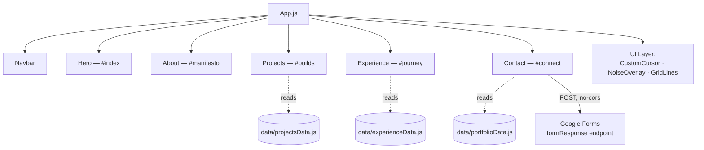

<div align="center">

# DevPortfolio

**Personal portfolio of Devashish Sharma** — AI & Full-Stack Engineer. A single-page, animation-driven site with a custom cursor, grain texture, and magnetic interactions, built with React and Tailwind CSS.

[](https://react.dev/)
[](https://tailwindcss.com/)
[](https://dev-portfolio-lyart-six.vercel.app/)

[Live Site](https://dev-portfolio-lyart-six.vercel.app/) · [Demo](#demo) · [Features](#features) · [Quick Start](#quick-start)

</div>

---

<details>
<summary><strong>Table of Contents</strong></summary>

1. [Introduction](#introduction)
2. [Demo](#demo)
3. [Features](#features)
4. [Architecture](#architecture)
5. [Working](#working)
6. [Tech Stack](#tech-stack)
7. [Project Structure](#project-structure)
8. [Quick Start](#quick-start)
9. [Contribution](#contribution)
10. [Contact](#contact)
11. [License](#license)

</details>

---

## Introduction

DevPortfolio is the personal site of Devashish Sharma, presented as a single-page, terminal/HUD-inspired experience rather than a conventional resume page. The design leans into a dark theme with a signature lime-green (`#ccff00`) accent, monospace section labels, and a handful of custom interaction layers — a tracked cursor, a subtle grain overlay, and magnetic hover elements — that give the static content page a tactile, "system console" feel.

The page is structured as five scrollable sections — **Index** (hero), **Manifesto** (about), **Builds** (projects), **Journey** (experience), and **Connect** (contact) — all rendered from plain data files so content can be updated without touching layout code.

## Demo

> Add a screenshot or short screen recording of the hero section, the project hover-reveal interaction, and the contact form here.

<div align="center">

| Hero | Projects (hover) | Contact |
|:---:|:---:|:---:|
|  |  |  |

</div>

**Live:** [dev-portfolio-lyart-six.vercel.app](https://dev-portfolio-lyart-six.vercel.app/)

## Features

- **Custom cursor** — Replaces the system cursor with a tracked, animated dot/ring for a more deliberate, app-like feel.
- **Noise & grid overlays** — A subtle grain texture and grid-line background add visual depth without relying on images.
- **Magnetic elements** — Buttons and social icons are gently pulled toward the cursor on hover via a reusable `MagneticElement` wrapper.
- **Scroll-reveal animations** — Sections fade and slide into view as the user scrolls, powered by a custom `useScrollReveal` hook.
- **Interactive project index** — Each project row expands on hover to reveal its description, tech tags, and a link to its GitHub repository.
- **Data-driven content** — Projects, experience, and social links live in plain JS data files, so updating content never requires touching component markup.
- **Serverless contact form** — Submits directly to a Google Forms endpoint client-side, with no backend or API key required.
- **Fully responsive** — Built mobile-first with Tailwind CSS utility classes throughout.

## Architecture

The app is a single React tree: `App.js` composes the page sections and a separate "UI layer" of visual effects that render above everything else. Content-bearing sections pull their data from `src/data/`, and the contact form posts directly to an external Google Form — there is no backend.



| Layer | Responsibility |
|---|---|
| `components/` | Page sections — Navbar, Hero, About, Projects, Experience, Contact |
| `components/ui/` | Decorative/interactive effects — cursor, grid lines, noise, magnetic wrapper |
| `data/` | All editable content — project list, experience timeline, social links |
| `hooks/` | Shared behavior — mouse position tracking, scroll-triggered reveals |

## Working

1. **Mount** — `App.js` renders the UI effect layer (cursor, noise, grid) on top of the page, followed by the Navbar and the five content sections in order.
2. **Navigate** — Navbar links are in-page anchors (`#index`, `#manifesto`, `#builds`, `#journey`, `#connect`) that scroll to each section.
3. **Reveal** — As each section enters the viewport, `useScrollReveal` toggles visibility classes to animate text and cards into place.
4. **Explore projects** — Hovering a project row expands it in place to show the description, tech stack tags, and a link to its repository, sourced from `projectsData.js`.
5. **Connect** — Submitting the contact form posts form fields to a Google Forms endpoint with `mode: "no-cors"`, so no server or API key is needed; a success message is shown optimistically on submit.

## Tech Stack

<table>
<tr>
<td><strong>Core</strong></td>
<td>


</td>
</tr>
<tr>
<td><strong>Styling</strong></td>
<td>


</td>
</tr>
<tr>
<td><strong>Icons</strong></td>
<td>


</td>
</tr>
<tr>
<td><strong>Forms</strong></td>
<td>

</td>
</tr>
<tr>
<td><strong>Deployment</strong></td>
<td>

</td>
</tr>
</table>

## Project Structure

```
DevPortfolio/
├── public/                # Static assets (favicon, manifest, profile photo)
├── src/
│   ├── components/             # Page sections (Hero, About, Projects, Experience, Contact, Navbar)
│   │   └── ui/                      # Visual effects (cursor, grid lines, noise, magnetic wrapper)
│   ├── data/                   # Editable content — projects, experience, socials
│   ├── hooks/                  # Custom hooks (mouse position, scroll reveal)
│   └── styles/                 # Global CSS
├── package.json
├── tailwind.config.js
└── README.md
```

## Quick Start

### Prerequisites

- [Node.js](https://nodejs.org/) 18+
- npm (bundled with Node.js)

### Environment

No environment variables are required. The contact form's Google Forms endpoint is a public `formResponse` URL embedded directly in `Contact.jsx` — there are no secrets to configure.

### Installation

```bash
git clone https://github.com/DevSharma03/DevPortfolio.git
cd DevPortfolio
npm install
```

### Running

```bash
npm start
```

The app runs at `http://localhost:3000` with hot reload enabled.

### Building for Production

```bash
npm run build
```

Outputs an optimized, minified build to the `build/` directory, ready to deploy to any static host (the live site is deployed on Vercel).

## Contribution

This is a personal portfolio, so it isn't designed to receive feature contributions — but bug reports and suggestions are welcome.

1. Fork the repository and create a feature branch:
   ```bash
   git checkout -b fix/your-fix-name
   ```
2. Make your changes and verify the build still passes:
   ```bash
   npm run build
   ```
3. Commit and open a pull request describing the change.

Please open an [issue](https://github.com/DevSharma03/DevPortfolio/issues) for bugs or suggestions.

## Contact

<div align="center">

[](https://github.com/DevSharma03)
[](https://linkedin.com/in/devsharma09)
[](https://dev-portfolio-lyart-six.vercel.app/)
[](mailto:work.devashishsharma09@gmail.com)

</div>

| Channel | Link |
|---|---|
| Issues | [Report a bug](https://github.com/DevSharma03/DevPortfolio/issues) |

## License

No `LICENSE` file is currently included in this repository. Since this is personal/portfolio code, consider adding one (for example, the [MIT License](https://choosealicense.com/licenses/mit/)) if you're comfortable with others reusing the code, or explicitly mark it "all rights reserved" if not.

<div align="center">

Built by [Devashish Sharma](https://github.com/DevSharma03)

</div>
